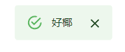

# global-component

- 基于react和mui5提供一些可供全局调用的组件接口，可自定义组件
- 可自定义拓展一些全局变量

## 使用

### 自定义全局变量
- 定义
```javascript
import {Global} from "global-component";

function Main({children}) {
    const {setExtend} = useContext(Global)
    useEffect(() => {
        const doSomething = () => {
            // doSomething...
        }
        const someVar = {
            // defineSomthing
        }
        setExtend({doSomething, someVar})
    }, [])
    return children
}
```
- 使用
```javascript
function Component(props) {
    const {extend} = useContext(Global)
    const {doSomething, someVar} = extend
    doSomething()
    return <></>
}

```

### 常用组件

```javascript
import Master, {Global} from "global-component";
import Button from "@mui/material/Button";

function App() {
    const {openTip} = useContext(Global)
    return <Button onClick={() => {
        openTip("好椰")
    }}>
        click
    </Button>
}

ReactDOM.render(
    <React.StrictMode>
        <Master>
            <App/>
        </Master>
    </React.StrictMode>
    ,
    document.getElementById('root')
);
```



默认使用 [mui5](https://github.com/mui/material-ui) 的相关组件，可继承自定义的mui theme，可自定义

```javascript
import Master, {GlobalTip} from "global-component";

function Tip(props: GlobalTip) {
    const {
        open,
        autoHideDuration,
        type,
        info,
        onClose//用于将open set为false的函数 无需定义，使用即可
    } = props
    return <div className={'tip'}>
        {open ? <>content here</> : ""}
        <input type={"button"} onClick={() => onClose()}>关闭</input>
    </div>
}

ReactDOM.render(
    <React.StrictMode>
        <Master Tip={Tip}>
            <App/>
        </Master>
    </React.StrictMode>
    ,
    document.getElementById('root')
);
```


